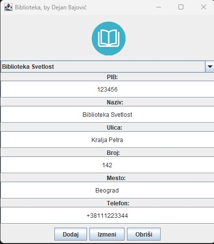

# ПРОЈЕКАТ БИБЛИОТЕКА

- Опис задатка: Библиотека се карактерише следећим релеватним подацима: назив, адреса, место, телефон. У библиотеци се за све чланове, приликом уписа, евидентирају следећи подаци: име, презиме, датум рођења, телефон (уколико га особа поседује), број чланске карте и адреса пребивалишта. Библиотека поседује књиге, које се јединствено идентификују својим ИСБН бројем, а остали подаци од значаја за информациони систем су: назив, језик, издавач, као и имена и презимена аутора. Књигу мора написати бар један писац, али може и више писаца да буде аутор једне књиге. У базу података уводимо само оне писце чије књиге библиотека поседује. Књига се мора налазити на дечијем, позајмном или научном одељењу. Уколико је на дечијем одељењу, у базу се уписује још и узраст за који је намењена, на позајмном актуелност и жанр, док на научном одељењу знамо назив научне области којој иста припада. Књиге се члановима могу изнајмљивати само од стране библиотекара који раде у библиотеци (у којој мора радити најмање један библиотекар) и том приликом се евидентира који члан је узео књигу, датум издавања и када се врати књига датум враћања. За библиотекаре знамо име, презиме, шифру запосленог, адресу, јмбг и евентуално телефон. Један библиотекар може издати члановима више књига, али не мора можда ниједну. Члан библиотеке не мора задужити ниједну књигу приликом уписа, а може позајмити и више књига одједном.
  
:white_check_mark: Потребно је креирати модел 
:white_check_mark: Написати sql наредбе за креирање базе података, табела, веза између табела 
:white_check_mark: Додати бар по два податка по табели 
:white_check_mark: Базу повезати са Јава пројектом 
:white_check_mark: Имплементирати CRUD операције бар за једну табелу 

